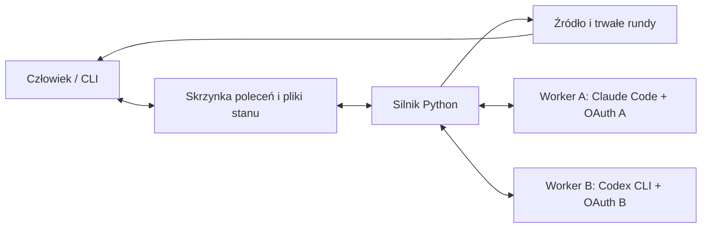

# Dual Reviewer — plan implementacji

> **For agentic workers:** REQUIRED SUB-SKILL: Use superpowers:subagent-driven-development (recommended) or superpowers:executing-plans to implement this plan task-by-task. Steps use checkbox (`- [ ]`) syntax for tracking.

**Goal:** Uruchamiać w Dockerze debatę Claude Code i Codex nad niezmiennym dokumentem, z mechanicznym konsensusem, kontrolą limitów, trwałą historią i prawem weta człowieka.

**Architecture:** Deterministyczny program w Pythonie steruje rundami, limitami i zatrzymywaniem procesu oraz tworzy raport bez wywołań modelu. Człowiek obsługuje go przez CLI i czyta pliki sesji; dwa odizolowane procesy robocze uruchamiają CLI recenzentów na ich własnym OAuth. Każda runda korzysta ze wspólnego, zamrożonego stanu poprzedniej rundy i jest zatwierdzana jednym trwałym zapisem. Hermes nie jest zależnością projektu.

**Tech Stack:** Python >=3.14 zgodnie z istniejącym `pyproject.toml`, biblioteka standardowa, `jsonschema` do walidacji protokołu, `pytest` do testów, Docker Compose, Claude Code CLI, Codex CLI. Konkretne wersje zewnętrznych narzędzi i modeli zostaną przypięte po teście zgodności w zadaniu 0.

**Spec:** [dual-reviewer-wymagania.md](../../../dual-reviewer-wymagania.md), [claude-code-get-used-limit.md](../../../claude-code-get-used-limit.md), z doprecyzowaniem użytkownika w rozmowie: wariant debaty, obsługa wyłącznie przez CLI i pliki, Hermes opcjonalny i bez roli sędziego. To doprecyzowanie ma pierwszeństwo przed pierwotnym wymaganiem komunikatora i wskazaniem Hermesa jako orkiestratora.

**Status:** Plan do przeglądu. Nie wykonano implementacji ani prób zużywających abonamenty. Plan zawiera jawne założenia produktowe i warunek wykonalności odczytu limitów.

## Global Constraints

- O-1: „Zero wywołań płatnego API” obu dostawców; wyłącznie istniejące abonamenty, bez dokupowania kredytów i automatycznego przechodzenia na płatne zużycie.
- O-2: „CLI w trybie nieinteraktywnym”, własne logowanie OAuth każdego recenzenta.
- O-3: „Orkiestrator nie może w pętli palić tokenów trzeciego dostawcy”. W tym projekcie sterowanie i raportowanie nie wywołują żadnego modelu.
- O-4: „Całość uruchamiana w Dockerze” lokalnie lub na VPS.
- F-1: „dokładnie jednej wypowiedzi każdego recenzenta” w ukończonej rundzie.
- F-6: „Twardy limit rund (domyślnie 5)”; pierwsza niezależna recenzja wlicza się do limitu.
- F-9: „poniżej 20%” pozostałego limitu blokuje start; dokładnie 20% nie blokuje.
- F-12: brak wiarygodnego odczytu oznacza pauzę, nigdy zgodę na start.
- F-17/F-21: plik `.md` po każdej rundzie; zatwierdzona historia jest „append-only”.
- F-4/N-1: źródło niezmienne, brak dostępu do prywatnych plików hosta, zapis recenzentów ograniczony do ich przestrzeni roboczej i technicznych danych własnego logowania CLI.
- N-3/N-4/N-5: deterministyczne sterowanie, brak TTY podczas pracy, idempotentne wznowienie.
- Poza zakresem: trzeci arbiter, automatyczna edycja źródła, GUI, wersjonowanie źródła, wiele równoległych sesji.

## Review Focus

1. Brak odczytu przed pierwszą rundą i po resecie: silnik nie może ani zgadywać 100%, ani wykonywać próbnego promptu jako kontroli limitu. Zadania 0 i 4.
2. Dwie równoczesne propozycje lub akceptacja starej wersji: nie mogą dać pozornego konsensusu. Zadanie 2.
3. Awaria po utrwaleniu rundy, przed aktualizacją statusu lub powiadomieniem: runda nie może zostać uruchomiona drugi raz. Zadania 3 i 7.
4. Ucięty JSON, brak stanowiska lub odpowiedź ze starej próby: nie mogą zostać uznane za pełną rundę. Zadania 1, 5 i 6.
5. Spóźnione/powtórzone weto, zamknięty terminal oraz restart w czasie oczekiwania: sterowanie ma pozostać jednoznaczne i nie blokować bez końca. Zadania 7 i 8.

---

## 1. Ustalenia i założenia implementacyjne

### 1.1 Decyzje produktowe po doprecyzowaniu w rozmowie

| Obszar | Założenie planu | Uzasadnienie / wpływ zmiany |
|---|---|---|
| Przebieg | Rozdział 10: niezależna pierwsza recenzja, potem ten sam stan wejściowy dla obu stron | Interpretacja odpowiedzi „Wariant debaty”; zachowuje symetrię. |
| Sterowanie | Deterministyczny program Python, bez Hermesa | Wymagane czynności to reguły procesu, nie ocena merytoryczna przez kolejnego agenta. |
| Obsługa | Wyłącznie CLI i odczytywanie plików | Zgodnie z odpowiedzią użytkownika; bez Telegrama, Discorda i integracji komunikatorów. |
| Weto | Proponowana wartość domyślna: 60 sekund po trwałym zapisie rundy i checkpointu | Konfigurowalne; brak reakcji i brak otwartego terminala oznaczają kontynuację. |
| Arbitraż | Brak trzeciego arbitra | Zgodnie z rozdziałem 10.7; spór trafia do raportu. |
| Kolejność wykonania | CLI kolejno: A, potem B, ale B otrzymuje ten sam zamrożony stan co A | Mniej aktywnych procesów i łatwiejsze zatrzymywanie; brak asymetrii informacyjnej. Równoległość nie jest potrzebna do spełnienia wymagań. |
| Język i zakres | Raport po polsku; poprawność techniczna, spójność argumentacji, brakujące założenia | Konfigurowalne przy tworzeniu sesji, niezmienne podczas wznowienia. |

Użytkownik wskazał, że Hermes miał jedynie pilnować procesu i limitów oraz „czy przypadkiem wszystko nie idzie za daleko”. Rekomendacja planu: pominąć Hermesa, ponieważ te obowiązki realizuje sam silnik. Nie dodawać opcjonalnej integracji na zapas. Gdyby wróciła potrzeba użycia Hermesa, obowiązuje wskazane przez użytkownika uruchomienie wyłącznie w kontenerze.

F-16 o komunikatorze poza terminalem zostaje zastąpione przez komunikaty CLI i czytelne pliki. F-11 pozostaje: pauza, jej powód i znany czas resetu lub następnej kontroli muszą być widoczne w plikach i przez `status`. Pliki wymagań zachowują pierwotną treść; ta sekcja zapisuje obowiązujące odstępstwa.

„Pilnowanie procesu” oznacza limit rund, limit prób, timeout procesu, limit rozmiaru kontekstu/odpowiedzi, kontrolę kompletności stanowisk, sprawdzanie limitów abonamentu i weto człowieka. Powtarzanie identycznego stanu merytorycznego przez dwie rundy powoduje oznaczenie `NO_PROGRESS` w statusie, bez wymuszania zgody i bez pomijania limitu rund. Oceny, czy argument jest trafny lub dyskusja merytorycznie odbiega od tematu, dokonują recenzenci według ustalonych kryteriów; silnik nie udaje sędziego.

### 1.2 Odczyt limitów Claude według dostarczonego dokumentu

Pierwszą badaną ścieżką jest dokładnie rozwiązanie z `claude-code-get-used-limit.md`: skrypt status line zapisujący `rate_limits.five_hour.used_percentage` i `rate_limits.five_hour.resets_at` do pliku. To konkretne źródło telemetrii i należy je wykorzystać, jeśli test potwierdzi jego dostępność. Osobno sprawdzamy, kiedy powstają dane i jak je odświeżyć: sam dokument wskazuje brak potwierdzenia działania status line pod `-p` oraz obecność danych dopiero po odpowiedzi modelu. Posiadanie pól limitu i możliwość sprawdzenia ich przed pierwszą rundą to dwa osobne warunki.

Końcowa propozycja w `claude-code-get-used-limit.md` pozwala rozpocząć rundę przy nieznanym limicie i dopiero reagować na błąd. Jest to sprzeczne z F-8/F-12. Pierwszeństwo mają wymagania: `unknown -> PAUSED_LIMIT_UNKNOWN`.

Informacja o limicie z odpowiedzi poprzedniej rundy nie wystarcza sama w sobie: może się zestarzeć, nie obejmować użycia na innych urządzeniach, a po resecie zniknąć. Zdarzenie `rate_limit` jest dodatkową ochroną podczas wykonania, nie zamiennikiem sprawdzenia przed rundą. Upływ pięciu godzin nie dowodzi, że odczyt znów jest dostępny ani że konto ma wolny limit.

**Warunek uruchomienia pełnego systemu:** zadanie 0 musi wykazać świeży odczyt obu kont przed pierwszą rundą i po resecie, bez TTY i bez zapytania do modelu. Negatywny wynik nie blokuje budowy rdzenia z atrapami, lecz blokuje uznanie F-8–F-12 i całego wdrożenia za spełnione. Potrzebna będzie wtedy konkretna decyzja o zmianie wymagania lub źródła telemetrii.

### 1.3 Co już sprawdzono przy przygotowaniu planu

- Projekt zawiera dwa dokumenty i `pyproject.toml`; nie ma jeszcze kodu aplikacji ani testów. Katalog nie jest obecnie repozytorium Git.
- Lokalnie dostępne CLI: Codex `0.155.1`, Claude Code `2.1.270`. Sprawdzono tylko wersje i pomoc, bez uruchamiania recenzji i odczytywania sekretów. Te wersje są kandydatami do weryfikacji w Linux/Docker, nie dowodem zgodności kontenerowej.
- Codex dokumentuje `account/rateLimits/read` przez App Server, z procentem użycia, długością okna i czasem resetu. Należy wybrać właściwy koszyk modelu i okno `windowDurationMins == 300`, nie zakładać, że `primary` zawsze oznacza 5 godzin. [Dokumentacja App Server](https://learn.chatgpt.com/docs/app-server).
- Claude dokumentuje `rate_limits.five_hour` w status line, ale dane pojawiają się dopiero po odpowiedzi modelu. To nie potwierdza samodzielnego odczytu przed rundą w `-p`. [Dokumentacja status line](https://code.claude.com/docs/en/statusline).
- Oba CLI obsługują wynik zgodny z JSON Schema: Claude przez `--json-schema`, Codex przez `--output-schema`. [Claude headless](https://code.claude.com/docs/en/headless), [Codex non-interactive](https://learn.chatgpt.com/docs/non-interactive-mode).
- Lokalna pomoc Claude `2.1.270` opisuje `--bare` jako tryb bez odczytu OAuth. Nie stosować go w tym projekcie. Nie kopiować bez weryfikacji rekomendacji dotyczących starszych wersji CLI.

## 2. Architektura docelowa



Trzy usługi Compose: `engine`, `claude-worker`, `codex-worker`. Podział służy izolacji obu recenzentów; nie dodaje trzeciego agenta modelowego. Komunikacja wewnętrzna przez plikowe skrzynki z atomową publikacją plików JSON; bez własnego publicznego serwera HTTP, bez wystawiania portów i bez montowania Docker socket.

Tylko `engine` montuje katalog kanonicznej historii do zapisu. Worker A widzi własne zadania i wyniki, własną konfigurację logowania oraz własny katalog roboczy; worker B analogicznie. Worker nie montuje historii sesji ani skrzynki partnera. Źródło i stan potrzebny do recenzji przychodzą w zadaniu jako dane. Model nie dostaje narzędzi zapisu; izolacja plików jest dodatkowo wymuszona montowaniami kontenerów.

Polecenia `peer-reviewer start/status/stop/resume/report/accept` działają w kontenerze `engine`; wywołanie z hosta przez `docker compose exec -T engine peer-reviewer ...`. Silnik uruchamia się jako trwała usługa przez `peer-reviewer serve`; komendy sterujące publikują żądania i nie uruchamiają drugiego silnika. Użytkownik może także bezpośrednio czytać pliki z katalogu sesji na hoście. Zamknięcie terminala lub SSH nie zatrzymuje usługi. `start` przyjmuje ścieżkę dostępną w zamontowanym katalogu wejściowym, nie dowolną ścieżkę hosta ani polecenie powłoki.

### 2.1 Pliki projektu i ich odpowiedzialności

```text
pyproject.toml                         pakiet, entry point, zależności/testy
src/peer_reviewer/__init__.py
src/peer_reviewer/cli.py                serve/start/resume/status/stop/report/accept/doctor
src/peer_reviewer/config.py             walidacja ustawień i niezmienny config sesji
src/peer_reviewer/protocol.py           walidacja wypowiedzi i zadań workerów
src/peer_reviewer/schemas/turn.json     wspólny JSON Schema wypowiedzi
src/peer_reviewer/debate.py             wersje, stanowiska, redukcja, konsensus
src/peer_reviewer/prompts.py            identyczny kontekst i instrukcje recenzji
src/peer_reviewer/store.py              atomowy zapis rund, odtwarzanie, blokada
src/peer_reviewer/limits.py             normalizacja i decyzja start/pauza
src/peer_reviewer/adapters/claude.py    argv, odpowiedź i telemetria Claude
src/peer_reviewer/adapters/codex.py     argv, odpowiedź i App Server Codex
src/peer_reviewer/adapters/process.py   subprocess, timeout, limity strumieni
src/peer_reviewer/mailbox.py            publikacja/odbiór wiadomości i korelacja
src/peer_reviewer/worker.py             wykonanie zadań jednego dostawcy
src/peer_reviewer/engine.py             maszyna stanów sesji
src/peer_reviewer/control.py            komendy, weto, akceptacja raportu
src/peer_reviewer/report.py             czytelne rundy i raport bez modelu
docker/Dockerfile.engine
docker/Dockerfile.claude
docker/Dockerfile.codex
compose.yaml                          montowania, użytkownicy, restart, limity
config/example.toml                    jawne ustawienia bez sekretów
docs/feasibility.md                    wynik zadania 0 i przypięte wersje
docs/operations.md                     logowanie, start, awaria, wznowienie
tests/unit/                           protokół, reduktor, limity, raport
tests/integration/                    procesy, pliki, kontrola przez CLI
tests/e2e/                            kontenery z atrapami i test opt-in OAuth
tests/fixtures/                       jawne odpowiedzi CLI i przebiegi debat
```

`jsonschema` to jedyna proponowana zależność aplikacji poza biblioteką standardową. Nie dodawać SDK inferencji dostawców, bazy danych, brokera ani frameworka agentowego do silnika.

### 2.2 Katalog sesji

```text
sessions/<session_id>/
  source.txt                          oryginalne bajty, niezmienna kopia
  session.json                        hash źródła, config, modele, wersje CLI
  rounds/0001/round.md                 pełne wypowiedzi i rozstrzygnięcia
  rounds/0001/round.json               dane do mechanicznego odtworzenia
  rounds/0001/checksums.json           kontrola integralności paczki
  rounds/0002/...                      kolejne niezmienne paczki
  runtime/state.json                  atomowo wymieniany widok stanu
  runtime/status.md                   ten sam stan w czytelnej postaci
  runtime/events/<event_id>.json      trwałe zdarzenia sterujące
  runtime/events/<event_id>.md        czytelne komunikaty o rundach/pauzach
  runtime/commands/                   żądania CLI i potwierdzenia silnika
  attempts/<attempt_id>/              diagnostyka nieukończonych prób
  report.md                          raport wygenerowany z ukończonych rund
  acceptance.json                    opcjonalna jawna akceptacja człowieka
  session.lock                       blokada jednego silnika
```

Katalogi skrzynek i przestrzeni workerów są osobnymi podkatalogami deploymentu, montowanymi selektywnie. Nigdy nie montować workerowi całego `sessions/`. Dane OAuth nie trafiają do `round.json`, raportów, fixture ani logów. Historia rund jest append-only; `state.json` i `report.md` są odtwarzalnymi widokami i mogą być wymieniane atomowo.

## 3. Kontrakty procesu i danych

### 3.1 Wypowiedź i rejestr

Wspólny format wypowiedzi `Turn`:

```json
{
  "schema_version": 1,
  "session_id": "s-001",
  "round_no": 2,
  "reviewer": "A",
  "input_state_hash": "sha256:...",
  "review_complete": true,
  "new_issues": [],
  "proposals": [],
  "positions": [
    {
      "issue_id": "A-1",
      "action": "accept",
      "version_ref": "sha256:...",
      "argument_id": "A-r2-1",
      "reason": "Podtrzymuję uwagę i tę wersję poprawki.",
      "responds_to": [],
      "evidence": []
    }
  ]
}
```

Powyższe skrócone wartości hash są ilustracją formatu; walidator przyjmuje pełny prefiks i 64 znaki hex. Konkretne fixture testowe obliczają hashe funkcją `version_id`.

- `new_issues`: obiekty `{id, author, anchor, problem, significance, reasoning, suggested_fix}`. `anchor` zawiera `line_start`, `line_end`, `quote`; zakres i cytat muszą odpowiadać niezmiennemu źródłu. ID ma postać `A-1`, `B-1`, numer rośnie w ramach autora przez całą sesję. Nie scalać semantycznie zgłoszeń.
- `proposals`: obiekty `{local_ref, issue_id, payload}`. `local_ref` jest unikalne w wypowiedzi. `payload` zawiera `problem`, `fix`, `resolution`, `rationale`, `duplicate_of`, `closes`. `resolution` to `accepted`, `rejected` lub `duplicate`; `duplicate_of` to ID celu lub `null`; `closes` to posortowane identyfikatory wcześniejszych propozycji, które ta wersja rozstrzyga.
- `positions`: dokładnie jedno stanowisko dla każdej uwagi istniejącej na wejściu rundy oraz każdej własnej nowej uwagi. Nie wymaga się odpowiedzi na nową uwagę partnera z bieżącej rundy. `action` to `accept`, `oppose` lub `propose`. `version_ref` wskazuje znaną wersję albo własne `local_ref`. `propose` oznacza jawną akceptację proponowanej wersji przez jej autora, nigdy przez partnera.
- Pierwsza uwaga ma też pierwszą propozycję rozstrzygnięcia i stanowisko autora. W późniejszych rundach `accept` tej samej wersji wystarcza jako krótkie potwierdzenie.
- Argumenty mają globalnie unikalne ID z autorem i rundą. Stanowisko rejestruje argument pod `argument_id`, z tekstem `reason` i referencjami `responds_to`/`evidence`. Sprzeciw i propozycja wymagają uzasadnienia. Zmiana stanowiska wymaga `responds_to` wskazującego konkretny znany argument lub nowego własnego argumentu popartego niepustym `evidence`. `evidence` jest listą kotwic źródłowych o takim samym formacie jak `anchor`. Rejestr zachowuje oba typy dowodów. Walidacja sprawdza referencje i obecność uzasadnienia, nie jego prawdziwość.
- Dla spornej uwagi w rundzie N>1 stanowisko musi odnieść się do ostatniego dostępnego argumentu partnera albo wyraźnie go podtrzymać/odrzucić. Uzgodnione pozycje można potwierdzić bez powtarzania tekstu.
- Wypowiedzi mają `additionalProperties: false`; odrzucać powtórzone klucze JSON, błędne typy, powielone ID i obce referencje. Surowy tekst recenzji nigdy nie staje się poleceniem systemowym.

`version_id(issue_id, payload)` to SHA-256 kanonicznego JSON zawierającego ID uwagi i cały payload. Kanonizacja: UTF-8, `sort_keys=True`, `separators=(",", ":")`, `ensure_ascii=False`, `allow_nan=False`; bez parafrazowania i normalizacji tekstu. Zmiana treści, poprawki, powodu, celu duplikatu lub listy zamykanych propozycji daje nową wersję.

**Rozstrzygnięcie uwagi:** obie strony jawnie akceptują identyczny `version_id`, brak aktualnego sprzeciwu, a zaakceptowana wersja zamyka pozostałe aktywne propozycje. `closes` może wskazywać tylko propozycje widoczne na wejściu rundy; zapobiega to akceptowaniu nieznanej zmiany. Jeśli A i B jednocześnie proponują różne wersje, obie pozostają otwarte. Zamknięcie propozycji staje się skuteczne dopiero przy wspólnej akceptacji.

Duplikat wymaga wspólnej akceptacji celu i uzasadnienia; nie może wskazywać siebie ani tworzyć cyklu. Cel musi istnieć i mieć ostatecznie uzgodnione rozstrzygnięcie. Wycofanie przez autora to propozycja `rejected`, a nie automatyczne usunięcie uwagi.

**Konsensus sesji:** co najmniej dwie ukończone rundy, obie kompletne wypowiedzi w ostatniej rundzie, każda uwaga rozstrzygnięta, żadnych otwartych propozycji i sprzeciwów. Dwie puste, niezależne pierwsze recenzje wymagają jawnego potwierdzenia w drugiej rundzie. Przy `max_rounds=1` wynik to brak konsensusu.

### 3.2 Limity

`LimitSample` zawiera `provider`, `account_fingerprint`, `model_bucket`, `observed_at`, `source`, `confidence`, `five_hour` i opcjonalne `other_blockers`. `five_hour` to `{used_percent, resets_at, window_seconds: 18000}` albo `null`. Fingerprint jest nieodwracalnym lokalnym identyfikatorem konta; żadnych tokenów OAuth.

`GateDecision` zawiera `allow`, `reason`, `wake_at`, `next_check_at` i odczyty obu stron. Zasady:

1. Wymagane są dwa świeże, wiarygodne odczyty właściwych kont/koszyków. Domyślnie ważność 60 sekund; wiek liczony od pobrania danych dostawcy, nie od ponownego zapisu cache.
2. `remaining = 100 - used_percent`; blokuje wyłącznie `remaining < 20`. Odrzucać NaN, nieskończoność, wartości spoza 0–100, reset w przeszłości, nieznane okno i niezgodność konta.
3. Dla znanych niskich limitów `wake_at` to najpóźniejszy reset blokujących okien plus 5 sekund. Po wybudzeniu zawsze ponownie odczytać obie strony. Nie przyjmować automatycznie 100%.
4. Nieznany limit: `wake_at=null`, jawny powód i `next_check_at`; ponowienia bez inferencji po 60, 120, 240, maksymalnie 900 sekundach, z respektowaniem dłuższego `Retry-After`.
5. Jawnie wyczerpany limit tygodniowy/inny także blokuje, nawet przy wolnym 5h. Brak opcjonalnej telemetrii tygodniowej nie jest sam w sobie brakiem wymaganego odczytu 5h.
6. Błąd limitu podczas recenzji przerywa próbę rundy i przełącza do pauzy. Stan ukończonych rund pozostaje nienaruszony.

Próg 20% jest warunkiem startu, nie gwarancją, że dowolnie długa runda zmieści się w pozostałym limicie. Dlatego potrzebna jest także obsługa przerwania w trakcie.

### 3.3 Stan i wznowienie

```text
NEW -> CHECK_LIMITS -> RUNNING_A -> RUNNING_B -> COMMIT_ROUND -> CHECKPOINT
CHECK_LIMITS -> PAUSED_LIMIT_LOW / PAUSED_LIMIT_UNKNOWN -> CHECK_LIMITS
CHECKPOINT -> STOPPED / CONSENSUS / NO_CONSENSUS / CHECK_LIMITS
dowolna faza wykonania -> ERROR (bez zatwierdzenia niepełnej rundy)
STOPPED / ERROR -> resume -> odtworzenie ostatniej ukończonej rundy
CONSENSUS / NO_CONSENSUS -> raport -> oczekiwanie na opcjonalne accept
```

`state.json`: `session_id`, `phase`, `last_completed_round`, `active_attempt`, `reason`, `limits`, `wake_at`, `next_check_at`, `checkpoint_deadline`, `stop_requested`, `progress_status`, `updated_at`, `heartbeat_at`, `report_status`. Wszystkie daty UTC RFC3339; komunikaty mogą dodatkowo pokazywać Europe/Warsaw. `status` wykrywa brak heartbeat, zamiast uznawać stary status `RUNNING` za dowód żywego procesu. `status.md` to odtwarzalny widok tych samych danych, z czasem ostatniej aktualizacji.

Maszyna sterująca korzysta z wstrzykiwanego zegara. Terminy trwałe zapisuje w UTC, krótkie oczekiwanie mierzy monotonicznie. Pętla oczekiwania obsługuje weto i sygnały co najwyżej co sekundę.

Weto podczas rundy oznacza zatrzymanie po jej trwałym zapisie; podczas pauzy — natychmiastowe zatrzymanie na ostatniej ukończonej rundzie. Awaria lub wymuszone zabicie procesu może utracić tylko bieżącą rundę. Runda z poprawnym A i błędnym B nie jest zatwierdzona; nowa próba dostaje nowy identyfikator i odtwarza obie wypowiedzi z ostatniego wspólnego stanu. Nie obiecywać wykonania inferencji dokładnie raz po awarii sieci; gwarancja dotyczy zatwierdzonej historii.

## 4. Kolejność prac

Zależności: `1 -> 2 -> 3`, `1 -> 4`, `1 -> 5 -> 6`, `3+4+5+6 -> 7`, `3+6 -> 8`, `7+8 -> 9 -> 10`. Zadanie 0 ustala rzeczywiste możliwości CLI przed końcowym podłączeniem zadań 5/6. Zadania rdzenia oraz integracje z atrapami można realizować przed pozytywnym wynikiem zadania 0. Nie uruchamiać produkcyjnych recenzji, zanim test wykonalności limitów nie zakończy się powodzeniem.

Każde zadanie kodowe: najpierw test wskazanego zachowania, uruchomienie potwierdzające porażkę, implementacja, ponowne uruchomienie wskazanego zakresu. Komendy poniżej są instrukcją dla implementacji, nie listą testów już wykonanych. Jeśli projekt zostanie objęty Git, zakończyć każde zadanie osobnym commitem; nie inicjalizować repozytorium jako ukrytego efektu przygotowania tego dokumentu.

### Zadanie 0: Potwierdzić logowanie i odczyt limitów

**Pliki:** utworzyć `docs/feasibility.md`, `tests/fixtures/limits/*.json`, `scripts/probe_capabilities.py`, `tests/integration/test_capabilities.py`.

**Interfejs:** wynik `probe_capabilities() -> dict` z polami `versions`, `subscription_auth`, `statusline_in_print_mode`, `preflight_before_first_turn`, `preflight_after_reset`, `headless`, `blocking_reasons`. Próba nie drukuje sekretów. Jej tymczasowe obrazy i skrypty są materiałem badawczym; produkcyjne Dockerfile powstają w zadaniu 6.

- [ ] Sprawdzić CLI w docelowych obrazach Linux, logowanie subskrypcyjne oraz odświeżanie tokenów po restarcie. Interaktywne logowanie to jednorazowy provisioning poza pętlą; nie wymaga TTY w działającej usłudze. Nie kopiować całych domowych konfiguracji, pluginów ani hostowego keychain do kontenera.
- [ ] Dla Codex zestawić App Server przez stdio: `initialize`, poczekać na odpowiedź, `initialized`, `account/read`, `account/rateLimits/read`. Oczekiwany wynik: właściwy typ konta, właściwy koszyk i rzeczywiste okno 300 minut, bez `thread/start` ani `turn/start`.

```json
{"id":1,"method":"initialize","params":{"clientInfo":{"name":"dual-reviewer-probe","version":"0.1.0"}}}
{"method":"initialized","params":{}}
{"id":2,"method":"account/read","params":{}}
{"id":3,"method":"account/rateLimits/read","params":{}}
```

- [ ] Dla Claude wykonać najpierw eksperyment status line z dostarczonego dokumentu, w odizolowanej konfiguracji kontenerowej: skrypt zapisuje otrzymane JSON z czasem pomiaru; sprawdzić plik przed promptem, po pojedynczym `claude -p` i po resecie. Ten jednorazowy prompt badawczy zużywa abonament i nie jest produkcyjnym mechanizmem kontroli limitów. Osobno zapisać wynik dostępności kanału (`statusline_in_print_mode`) i możliwość preflight. Odczyt po odpowiedzi nie zalicza testu preflight. Nie używać tmux/PTY, dodatkowych promptów w każdej kontroli ani sumy `total_cost_usd` jako produkcyjnego rozwiązania. Jeśli kanał nie wystarcza, zbadać bezgeneracyjne źródło danych konta w przypiętej wersji CLI. Jeśli jedyną możliwością okaże się nieudokumentowany endpoint metadanych OAuth, opisać go i ryzyko utrzymania jako osobny wariant wymagający decyzji; nie podmieniać nim po cichu zatwierdzonego projektu.
- [ ] Powtórzyć pomiar dla zimnego startu, po resecie, po użyciu konta poza systemem, po wygaśnięciu tokenu i przy 429. Zanonimizowane payloady zapisać jako fixture wraz z wersją narzędzia i datą.
- [ ] Zapisać jednoznaczne GO/NO-GO. Przypiąć wyłącznie faktycznie sprawdzone wersje narzędzi, obrazów i modele dostępne w abonamentach. Nie oznaczać testu Claude jako zaliczonego na podstawie samych dokumentów.

```python
def test_real_preflight_contract(capability_result):
    assert capability_result["subscription_auth"] is True
    assert capability_result["preflight_before_first_turn"] == {"A": True, "B": True}
    assert capability_result["preflight_after_reset"] == {"A": True, "B": True}
    assert capability_result["headless"] is True
    assert capability_result["blocking_reasons"] == []
```

Fixture `capability_result` czyta wynik konkretnego uruchomienia `probe_capabilities`; brak wyniku daje SKIP z powodem, nigdy PASS. Uruchomienie przed konfiguracją pakietu: `uv run --python 3.14 --with pytest pytest tests/integration/test_capabilities.py -m live -v`. To jedyny etap, w którym brak technicznej możliwości może wymagać zmiany specyfikacji przed wdrożeniem.

### Zadanie 1: Pakiet, konfiguracja i walidowany protokół wypowiedzi

**Pliki:** zmodyfikować `pyproject.toml`; utworzyć `__init__.py`, `config.py`, `protocol.py`, `schemas/turn.json`, `tests/unit/test_protocol.py`, `tests/unit/test_config.py`, `tests/fixtures/turns/*.json`.

**Interfejsy:** `parse_turn(raw: bytes, expected: dict, state: dict, source: str) -> dict`; `load_config(path: Path) -> dict`; błędy `ProtocolError`, `ConfigError`. `expected` zawiera `session_id`, `round_no`, `reviewer`, `input_state_hash`; stan wejściowy zawiera mapy `issues`, `versions`, `arguments`.

- [ ] Przygotować poprawne fixture: niezależne A/B, pełne stanowiska rundy 2, zmiana po kontrargumencie. Testy uszkodzonych odpowiedzi obejmują brak pozycji, powielony klucz, obce ID, błędny cytat, nieznany hash, brak uzasadnienia i nadmiarowe pola.

```python
import pytest
from peer_reviewer.protocol import ProtocolError, parse_turn

def test_truncated_json_never_becomes_turn():
    with pytest.raises(ProtocolError):
        parse_turn(b'{"schema_version":1,', {}, {}, "tekst")
```

- [ ] Uruchomić `uv run pytest tests/unit/test_protocol.py tests/unit/test_config.py -q`; przed implementacją oczekiwany błąd importu lub walidacji.
- [ ] Dodać konfigurację budowania pakietu w układzie `src/`, entry point `peer-reviewer = "peer_reviewer.cli:main"`, zależności aplikacji i grupę `dev` z pytest. Zarejestrować markery `live` i `docker`; uruchomienia `live` wymagają jawnego opt-in, a zwykłe testy nie mają dostępu do prawdziwych kont. Wdrażać kontrakt z sekcji 3.1, czytać JSON z odrzucaniem duplicate keys, następnie sprawdzać schema i referencje domenowe. `max_rounds >= 1`, próg 20%, `veto_seconds=60`, `limit_max_age_seconds=60`, jawne modele i przypięte wersje w config sesji.

```python
def reject_duplicate_keys(pairs):
    result = {}
    for key, value in pairs:
        if key in result:
            raise ProtocolError(f"Powtórzony klucz: {key}")
        result[key] = value
    return result
```

- [ ] Ponowić testy. Warunek ukończenia: niekompletny wynik nie dociera do reduktora; wznowienie odrzuca zmianę źródła, kryteriów, modeli i limitu rund względem zapisanej konfiguracji.

### Zadanie 2: Rejestr wersji i mechaniczny konsensus

**Pliki:** `debate.py`, `tests/unit/test_debate.py`, `tests/fixtures/debates/{agreement,rejection,dispute,duplicates,empty}.json`.

**Interfejsy:** `initial_state(session_id: str) -> dict`; `version_id(issue_id: str, payload: dict) -> str`; `reduce_round(previous: dict, turns: tuple[dict, dict]) -> dict`; `has_consensus(state: dict) -> bool`. Stan zawiera `round_no`, `issues`, `versions`, `arguments`, `positions`, `open_proposals`, `consensus`.

- [ ] Zapisać fixture ze scenariuszem: A zgłasza problem, B podaje kontrargument, A proponuje odrzucenie z referencją do tego argumentu, obaj akceptują identyczną wersję odrzucenia. Osobne przypadki: dwie równoczesne modyfikacje, jednostronne wycofanie, stara akceptacja, nowa uwaga w rundzie 5, cykl duplikatów, puste recenzje.

```python
from peer_reviewer.debate import version_id

def test_changed_rationale_requires_new_acceptances():
    original = dict(problem="P", fix="F", resolution="accepted",
                    rationale="R1", duplicate_of=None, closes=[])
    changed = {**original, "rationale": "R2"}
    assert version_id("A-1", original) != version_id("A-1", changed)
```

- [ ] Uruchomić `uv run pytest tests/unit/test_debate.py -q` i potwierdzić porażkę testów niezaimplementowanych zachowań.
- [ ] Implementować czysty reduktor bez I/O. Walidować oba wejścia wobec tego samego poprzedniego stanu; dopiero potem scalić zdarzenia według stałego porządku A/B i ID. Zachować stare wersje i argumenty. Konsensus obliczać z aktualnych jawnych deklaracji, bez dziedziczenia zgody po zmianie wersji.

```python
import hashlib
import json

def version_id(issue_id, payload):
    encoded = json.dumps(
        {"issue_id": issue_id, "payload": payload}, sort_keys=True,
        separators=(",", ":"), ensure_ascii=False, allow_nan=False,
    ).encode("utf-8")
    return "sha256:" + hashlib.sha256(encoded).hexdigest()
```

- [ ] Ponowić testy; dodać sprawdzenie, że zamiana kolejności przekazania odpowiedzi A/B nie zmienia stanu merytorycznego, a pominięcie pozycji nie staje się zgodą. Oczekiwany wynik: pełne pokrycie reguł sekcji 3.1 bez jakiegokolwiek modelu.

### Zadanie 3: Atomowa historia, blokada i odtwarzanie po awarii

**Pliki:** `store.py`, część `report.py` renderująca rundę, `tests/integration/test_store.py`.

**Interfejsy:** `SessionStore(root: Path)` z metodami `create(source: bytes, config: dict) -> None`, `commit_round(bundle: dict) -> None`, `recover() -> dict`, `write_event(event: dict) -> None`, `write_status(status: dict) -> None`, `lock()` jako context manager. `bundle` zawiera obie wypowiedzi, stan wynikowy, hashe wejścia/źródła, numer rundy i identyfikator próby. `render_round(bundle: dict) -> str`.

- [ ] Testować awarie przed/po fsync, przed/po rename oraz po publikacji rundy przed `state.json`; wymuszać fault injection na granicach operacji. Sprawdzać pełną starą albo pełną nową rundę, nigdy częściową. Drugi proces nie może przejąć aktywnej blokady.

```python
import pytest
from peer_reviewer.store import SessionStore, SourceChanged

def test_source_is_verified_on_recovery(tmp_path):
    store = SessionStore(tmp_path)
    store.create(b"tekst\n", {"max_rounds": 5})
    (tmp_path / "source.txt").write_bytes(b"inny tekst\n")
    with pytest.raises(SourceChanged):
        store.recover()
```

- [ ] Uruchomić `uv run pytest tests/integration/test_store.py -q`.
- [ ] Zapis rundy: utworzyć katalog staging na tym samym filesystemie; zapisać `round.md`, `round.json`, checksums; fsync plików i katalogu; pod blokadą sprawdzić brak docelowej rundy; rename katalogu do `rounds/000N`; fsync `rounds/`. Dopiero potem aktualizować status i uruchamiać powiadomienie. Istniejącej paczki nigdy nie zastępować.

```text
write staging files -> fsync each file -> fsync staging directory
assert next round number -> rename staging to rounds/000N -> fsync rounds
write derived state.json via temporary file + replace + fsync parent
```

- [ ] Odtwarzanie skanuje ciągłe, kompletne paczki, sprawdza sumy, źródło i łańcuch stanów oraz odtwarza reduktor. Pozostawiony staging nie jest ukończoną rundą. Uszkodzona ukończona paczka zatrzymuje sesję z błędem integralności; nie wolno po cichu cofnąć historii. Ponowny commit tego samego numeru i identycznej zawartości jest no-op; inna zawartość to błąd.
- [ ] Ponowić testy. Warunek ukończenia: każda widoczna ukończona runda ma od razu czytelny `.md`, a stary `state.json` nie prowadzi do ponownej inferencji.

### Zadanie 4: Bramkowanie limitów i trwałe pauzy

**Pliki:** `limits.py`, `tests/unit/test_limits.py`, fixture z zadania 0.

**Interfejsy:** `normalize_limit(provider: str, raw: dict, observed_at: datetime, account: str, bucket: str) -> dict`; `decide_round_start(samples: dict[str, dict], now: datetime, max_age_seconds: int = 60) -> dict`. Wyniki to `LimitSample`/`GateDecision` z sekcji 3.2. Brak źródła daje `confidence="unknown"`.

- [ ] Testy tabelaryczne: zużycie 79.9/80/80.1%, brak danych jednej strony, stare dane, przeszły reset, 429, zmiana konta, różne koszyki, 15-minutowe `primary`, wyczerpane okno tygodniowe, niezależne terminy resetu.

```python
from datetime import datetime, timedelta, timezone
from peer_reviewer.limits import decide_round_start

def test_unknown_provider_blocks_round():
    now = datetime(2026, 9, 19, tzinfo=timezone.utc)
    decision = decide_round_start({}, now)
    assert decision["allow"] is False
    assert decision["wake_at"] is None
    assert decision["next_check_at"] >= now + timedelta(seconds=60)
```

- [ ] Uruchomić `uv run pytest tests/unit/test_limits.py -q`.
- [ ] Implementować reguły z sekcji 3.2 jako funkcje bez oczekiwania i I/O. Weryfikować oba konta osobno. Reset i ponowne pobranie są dwiema osobnymi operacjami.

```text
missing/stale/invalid required sample -> pause unknown + next check
known blocking weekly window -> pause until its reset
either five-hour remaining < 20 -> pause until latest blocking reset
otherwise -> allow this round
```

- [ ] Ponowić testy. Oddzielny test wykazuje, że upływ `wake_at` z dawnym payloadem nadal blokuje; dopiero nowy poprawny odczyt umożliwia rundę.

### Zadanie 5: Adaptery CLI, bezpieczne procesy i kontekst rundy

**Pliki:** `adapters/{process,claude,codex}.py`, `prompts.py`, `tests/integration/test_adapters.py`, `tests/unit/test_prompts.py`, fixture wyników CLI.

**Interfejsy:** `build_context(source: str, state: dict, criteria: list[str]) -> dict`; `build_prompt(context: dict, reviewer: str) -> str`; każdy adapter udostępnia `review(job: dict) -> dict` oraz `read_limits() -> dict`. `run_cli(argv: list[str], stdin: bytes, cwd: Path, env: dict[str, str], timeout_seconds: int, max_output_bytes: int) -> dict` zwraca `returncode`, `stdout`, `stderr`, `timed_out`.

- [ ] Atrapy binariów zwracają: poprawny wynik, ucięty strumień, poprawny JSON przy niezerowym exit code, timeout, limit abonamentu, brak logowania i zbyt duży wynik. Testować zabicie całej grupy procesów, opróżnianie stdout/stderr bez deadlocka i brak sekretów w logach.

```python
import sys
from peer_reviewer.adapters.process import run_cli

def test_document_is_stdin_not_shell_code(tmp_path):
    result = run_cli(
        [sys.executable, "-c", "import sys; print(sys.stdin.read())"],
        b"$(touch injected) `touch injected2`", tmp_path, {}, 10, 4096,
    )
    assert result["returncode"] == 0
    assert not (tmp_path / "injected").exists()
    assert not (tmp_path / "injected2").exists()
```

- [ ] Uruchomić `uv run pytest tests/integration/test_adapters.py tests/unit/test_prompts.py -q`.
- [ ] Uruchamiać z listą argv i `shell=False`, tekstem przez stdin, zamkniętym TTY, kontrolowanym środowiskiem i świeżą sesją CLI dla każdej wypowiedzi. Nie stosować `resume --last`; źródłem kontekstu jest nasz rejestr. Claude: `-p`, JSON Schema, pusty zestaw narzędzi, brak automatycznych pluginów/MCP i pytań o uprawnienia. Codex: `exec`, `--skip-git-repo-check`, `--sandbox read-only`, `--ephemeral`, `--output-schema`, `--output-last-message`, polityka bez pytań i bez narzędzi dodatkowych. Ostateczne argv utrwalić testami dla przypiętych wersji.

```python
# Wzorzec uruchamiania, uzupełniany o zweryfikowane flagi dostawcy.
process = subprocess.Popen(
    argv, stdin=subprocess.PIPE, stdout=subprocess.PIPE,
    stderr=subprocess.PIPE, cwd=cwd, env=env,
    shell=False, start_new_session=True,
)
```

- [ ] Dopuszczać wynik dopiero po poprawnym zakończeniu CLI, końcowym komunikacie wyniku i walidacji `parse_turn`. Claude wyodrębnia `structured_output`; Codex odczytuje końcowy plik wyniku, nie dowolne zdarzenie JSONL. Nie naprawiać błędnego JSON dodatkowym modelem. Diagnostyka przechowuje bezpieczny kod błędu i ograniczony rozmiar danych.
- [ ] Wzorzec promptu: rola recenzenta; kryteria; źródło z numerami linii; wspólny stan; ostatnie wypowiedzi obu stron; wcześniejsze argumenty z referencjami; reguły formatu. Pierwsza runda zawiera wyłącznie źródło i instrukcje. Zakaz streszczania od nowa i kapitulacji bez argumentu. Dane dokumentu wyraźnie oznaczone jako materiał recenzji.
- [ ] Wprowadzić limity rozmiaru wejścia/wyjścia i czasu procesu w config; domyślnie 64 KiB źródła, 512 KiB promptu, 1 MiB odpowiedzi, 15 minut na CLI. To ograniczenia zasobów, nie estymacja tokenów. Przekroczenie daje jawny błąd; nie ucinać źródła ani stanowisk. Przed wdrożeniem sprawdzić te wartości na wybranych modelach.
- [ ] Ponowić testy, w tym równość `input_state_hash` obu kontekstów i brak bieżącej odpowiedzi A w promptcie B.

### Zadanie 6: Workery i granice kontenerów

**Pliki:** `mailbox.py`, `worker.py`, `docker/Dockerfile.{engine,claude,codex}`, `compose.yaml`, `tests/integration/test_mailbox.py`, `tests/e2e/test_isolation.py`.

**Interfejsy:** `publish(directory: Path, message: dict) -> Path`; `receive(directory: Path) -> list[dict]`; `Worker.run_once() -> bool`; `WorkerClient.limits() -> dict`, `submit(job: dict) -> str`, `poll(job_id: str) -> dict | None`, `cancel(job_id: str) -> None`. `Job` ma `job_id`, `session_id`, `round_no`, `attempt_id`, `reviewer`, `kind` (`review`/`limits`/`cancel`), `input_state_hash`, `payload`, `deadline`. Dla metadanych i anulowania pola rundy/stanu mogą być `null`; zadanie `cancel` wskazuje `payload.target_job_id`. Odpowiedź powtarza identyfikatory i zawiera `ok`, `result`, `error_code`. `WorkerClient` łączy obie skrzynki i udostępnia je silnikowi.

- [ ] Testować brak odczytu częściowego pliku, powtórzone `job_id`, spóźnioną odpowiedź, deadline, restart workera i brak widoczności plików partnera. Próbę traktować jako osobny byt od numeru ukończonej rundy.

```python
from peer_reviewer.mailbox import publish, receive

def test_unpublished_message_is_invisible(tmp_path):
    (tmp_path / "job.part").write_text('{"job_id":')
    assert receive(tmp_path) == []
    publish(tmp_path, {"job_id": "s1-r1-a1-A", "kind": "limits"})
    assert len(receive(tmp_path)) == 1
```

- [ ] Uruchomić `uv run pytest tests/integration/test_mailbox.py -q`.
- [ ] Wdrażać atomowe pliki `.json` przez plik tymczasowy i rename, stabilne ID i walidację komunikatu. Worker nie uruchamia drugi raz zakończonego zadania o tym samym ID. Zadanie przerwane w trakcie po restarcie zgłasza `interrupted`; decyzja o nowej próbie należy do silnika po sprawdzeniu limitów. Silnik odrzuca wyniki nieaktualnego `attempt_id`.

```text
engine writes A/inbox -> worker A reads A/inbox -> writes A/outbox
engine writes B/inbox -> worker B reads B/inbox -> writes B/outbox
worker A has no mounts for B, control commands or canonical rounds
worker B has no mounts for A, control commands or canonical rounds
```

- [ ] Kontenery: nie-root, root filesystem read-only, `cap_drop: ALL`, `no-new-privileges`, limity pamięci/procesów, `tty: false`, `stdin_open: false`, `restart: unless-stopped`. Zapisy runtime/cache kierować do własnego `/work`; osobne wolumeny logowania z możliwością odświeżenia przez CLI. Wyłącznie wyszczególnione montowania, bez hostowego HOME/SSH/vaulta i bez Docker socket. Nie przekazywać kluczy API ani ustawień alternatywnych płatnych providerów.
- [ ] Po restarcie silnika anulować stare zadania, doprowadzić workery do bezczynności i dopiero wtedy zlecić nową próbę; potrzebny potwierdzony cancel/timeout starego procesu. Worker obsługuje skrzynkę kontrolną także podczas pracy subprocessu, a potwierdzenie cancel wysyła dopiero po zakończeniu całej grupy procesów. `WorkerClient.cancel` ma ograniczony czas oczekiwania; brak potwierdzenia daje `ERROR` i blokuje ponowne zlecenie. Nie dopuszczać dwóch inferencji tego samego recenzenta naraz.
- [ ] Uruchomić `docker compose config --quiet` i `uv run pytest tests/e2e/test_isolation.py -m docker -q`. Testy używają atrap CLI; próbują nadpisać źródło/historię oraz odczytać skrzynkę partnera. Oczekiwane: odmowa lub brak montowania, niezależnie od instrukcji modelu.

### Zadanie 7: Silnik rund, pauzy, checkpoint i wznowienie

**Pliki:** `engine.py`, `tests/integration/test_engine.py`, `tests/fixtures/debates/*.json`.

**Interfejsy:** `Engine(store, workers, control, clock)` z `tick() -> dict`, `resume() -> dict`. `workers` udostępnia `limits() -> dict`, `submit(job: dict) -> str`, `poll(job_id: str) -> dict | None`, `cancel(job_id: str) -> None`; implementacja używa skrzynek zadania 6. `clock` ma `now() -> datetime`, `monotonic() -> float`. `control` dostarcza zatwierdzone żądania stop/wznowienia z zadania 8, na tym etapie atrapa.

- [ ] Przygotować testy z zegarem sterowanym i atrapami workerów: niski limit bez startu, automatyczny reset, nieznany odczyt, błąd B po sukcesie A, konsensus w rundzie 3, pięć rund sporu bez szóstej, crash po commit, crash podczas pauzy/checkpointu, weto podczas recenzji.

```text
Given: last_completed_round=2, a durable round 3 exists, state.json still says 2
When: Engine.resume()
Then: recover round 3; finish its checkpoint; do not submit round 3 again

Given: five complete disputed rounds and max_rounds=5
When: checkpoint 5 expires
Then: NO_CONSENSUS; zero submissions for round 6
```

- [ ] Uruchomić `uv run pytest tests/integration/test_engine.py -q`.
- [ ] Implementować maszynę z sekcji 3.3. Kolejność: sprawdzenie dwóch limitów, zamrożenie stanu, A, B na tym samym stanie, walidacja obu, redukcja, trwały commit `.md` i JSON, powiadomienie/checkpoint, ocena konsensusu i limitu rund. Przed uruchomieniem B można dodatkowo sprawdzić jego limit, jeśli odczyt zdążył się zestarzeć; blokada odrzuca próbę rundy zamiast zużywać tokeny B.

```text
if a committed round still needs its checkpoint: finish checkpoint first
elif stop requested: save STOPPED
elif limits disallow: persist pause and schedule next check
else: execute one immutable round attempt; commit only both valid turns
after checkpoint: stop > consensus > round limit > next round
```

- [ ] Deadline weta zapisać trwale w zdarzeniu checkpointu po zatwierdzeniu rundy, razem z treścią komunikatu dostępną dla CLI i widoku Markdown. Restart zachowuje istniejący deadline; crash przed jego utworzeniem odtwarza brakujący checkpoint. Brak terminala lub czytelnika nie blokuje kontynuacji po 60 sekundach. Spóźnione weto staje się stop na najbliższej bezpiecznej granicy i dostaje jednoznaczne potwierdzenie w pliku. Błąd trwałego zapisu daje `ERROR`, a nie kontynuację bez checkpointu.
- [ ] Przejściowe błędy transportu procesu: maksymalnie trzy ponowienia po pierwszej próbie, z odstępami 10/30/90 sekund, każde po nowym sprawdzeniu limitów. Błąd formatu, autoryzacji lub integralności daje `ERROR` i powiadomienie, bez nieograniczonej regeneracji. Rate limit daje pauzę, nie zwykły retry. Licznik ponowień jest trwały, aby restart nie otwierał nieskończonej pętli.
- [ ] Łącznie najwyżej cztery uruchomione próby recenzji na jedną rundę, wliczając próby przerwane limitem lub crashem; po ich wyczerpaniu `ERROR` i raport częściowy. Same bezgeneracyjne kontrole limitu nie zużywają tego licznika. Jawne `resume` po wyczerpaniu prób może przyznać nową pulę, zapisaną jako decyzja człowieka; restart usługi tego nie robi. Dwie kolejne rundy z identycznymi treściami wersji, stanowiskami i otwartymi propozycjami oznaczyć `NO_PROGRESS`; porównanie pomija daty, ID argumentów i numer rundy. Jest to informacja dla człowieka, nie rozstrzygnięcie sporu. Testy obejmują wyczerpanie prób po kolejnych resetach i brak postępu.
- [ ] Ponowić testy. Warunek ukończenia: każda ścieżka wznowienia ma jednoznaczny następny krok bez duplikacji rund.

### Zadanie 8: Sterowanie przez CLI, pliki stanu i weto

**Pliki:** `control.py`, część `cli.py` dotycząca sterowania, widoki statusu i zdarzeń w `report.py`, `tests/integration/test_control.py`, `tests/integration/test_status.py`.

**Interfejsy:** `submit_command(session: Path, command: dict) -> dict`; `Control.poll() -> list[dict]`; `render_status(state: dict) -> str`; `render_event(event: dict) -> str`. Komenda ma `command_id`, `session_id`, `kind`, `round_no`, `created_at`; potwierdzenie silnika zawiera `received_at`, `applied_at`, `outcome`. Autoryzacja przez dostęp do kontenera i uprawnienia katalogu kontrolnego; brak zdalnego API, kont komunikatora i modelu interpretującego komendy. Workery nie montują skrzynki poleceń użytkownika.

- [ ] Testować powtórzone ID polecenia, starą rundę, weto w pauzie, obcą sesję, brak potwierdzenia silnika, crash po przyjęciu komendy, zamknięty stdout i działanie bez podłączonego terminala. Sprawdzać, że recenzenci nie mogą pisać do katalogu kontrolnego.

```text
Given: round 2 is committed, command stop/42 already processed
When: CLI submits stop/42 again
Then: return the same acknowledgement; no extra state transition

Given: no terminal is attached and round 2 has a durable checkpoint
When: checkpoint deadline passes without a stop command
Then: continue; status.md and event files describe the transition
```

- [ ] Uruchomić `uv run pytest tests/integration/test_control.py tests/integration/test_status.py -q`.
- [ ] Komendy zapisują żądania atomowo przez `mailbox.publish`, a silnik przetwarza je idempotentnie. CLI rozróżnia „żądanie zapisane” i „sesja zatrzymana”; brak heartbeat daje ostrzeżenie o niedziałającym silniku, nie fałszywe potwierdzenie wykonania. `status --watch` odświeża widok do przerwania przez użytkownika; zamknięcie tego procesu nie zatrzymuje silnika.

```bash
docker compose up -d
docker compose exec -T engine peer-reviewer status --session /sessions/s-001
docker compose exec -T engine peer-reviewer status --session /sessions/s-001 --watch
docker compose exec -T engine peer-reviewer stop --session /sessions/s-001
cat sessions/s-001/runtime/status.md
cat sessions/s-001/rounds/0001/round.md
```

Powyższe komendy zakładają montowanie hostowego `./sessions` jako `/sessions`. Ścieżka na hoście jest konfigurowalna i nie zmienia logiki aplikacji. Użytkownik korzystający z VPS może czytać te same pliki i wykonywać CLI przez SSH.

- [ ] Komunikat rundy w zdarzeniu i CLI: ID sesji, numer rundy, liczby uwag uzgodnionych/odrzuconych/spornych, deadline, dokładna komenda weta. Komunikat pauzy: dostawca, powód, znany reset albo „czas resetu nieznany”, następna kontrola. Także zdarzenia błędu i raportu. Treść pochodzi z szablonu, bez LLM.
- [ ] `state.json` i trwałe zdarzenia sterujące są źródłem prawdy. `status.md` oraz pliki zdarzeń `.md` są deterministycznymi widokami wymienianymi atomowo; po crashu brakujący widok odtwarza się z JSON. Każdy widok pokazuje ID zdarzenia i czas aktualizacji, aby można było wykryć opóźnienie. Logowanie na stdout nie jest warunkiem zatwierdzenia zdarzenia ani kontynuacji procesu.
- [ ] Ponowić testy z odłączonym terminalem i niedostępnymi adapterami modeli. Oczekiwane: status/stop/odczyt historii działają bez inferencji i bez usług komunikacyjnych.

### Zadanie 9: Polecenia użytkownika i raport końcowy

**Pliki:** `cli.py`, pozostała część `report.py`, `config/example.toml`, `docs/operations.md`, `tests/unit/test_report.py`, `tests/integration/test_cli.py`.

**Interfejsy:** `main(argv: list[str] | None = None) -> int`; `render_report(state: dict, history: list[dict], outcome: str) -> str`. `outcome` to `CONSENSUS`, `NO_CONSENSUS`, `STOPPED` lub `ERROR`; dwa ostatnie oznaczają raport częściowy. `accept` zapisuje hash raportu i czas decyzji, nie zmienia konsensusu.

- [ ] Test raportu dla przyjętej uwagi, wspólnie odrzuconej, sporu, duplikatu i pustej debaty; sprawdzić stabilne ID, obie strony sporu, argument wycofania, link do rundy, status częściowy oraz deterministyczność renderowania.

```text
Given: A-1 accepted; A-2 jointly rejected because of B-r2-1;
       B-1 disputed; B-2 jointly linked as duplicate of A-1
Then report.md contains all four IDs, the rejection reason,
     both positions for B-1 and a duplicate link B-2 -> A-1
And B-2 is never labeled as substantively refuted
```

- [ ] Uruchomić `uv run pytest tests/unit/test_report.py tests/integration/test_cli.py -q`.
- [ ] Polecenia docelowe:

```bash
peer-reviewer doctor --config /config/reviewer.toml
peer-reviewer serve --config /config/reviewer.toml
peer-reviewer start /input/tekst.md --session /sessions/s-001
peer-reviewer status --session /sessions/s-001 --json
peer-reviewer stop --session /sessions/s-001
peer-reviewer resume --session /sessions/s-001
peer-reviewer report --session /sessions/s-001
peer-reviewer accept --session /sessions/s-001
```

- [ ] `start` waliduje zwykły plik tekstowy UTF-8 i rozmiar, kopiuje bajty, tworzy hash i config, odmawia nadpisania istniejącej sesji. Brak Git nie przeszkadza. `resume` na zakończonej sesji tylko odtwarza raport/status, bez dalszych recenzji. Globalna blokada deploymentu odrzuca drugą aktywną sesję. `stop` publikuje żądanie i nie zabija procesu podczas zapisu.
- [ ] Raport: status i zakres; uwagi uzgodnione z poprawkami; wspólnie odrzucone z powodami; sporne z oboma stanowiskami; duplikaty z linkami; odnośniki do rund; informacja o przerwaniu lub limicie. Bez modelowego streszczenia. Akceptacja człowieka jest osobnym faktem i nie jest domniemywana z braku weta.
- [ ] W `operations.md` opisać provisioning OAuth w kontenerach, wyłączenie dodatkowego płatnego zużycia w kontach, jawne modele, uruchomienie lokalne/VPS, odczyt statusu z hosta, wymianę tokenu, pauzę unknown, restart i kopię katalogu sesji. Samo usunięcie klucza API nie jest dowodem wyłączenia extra usage/kredytów.
- [ ] Ponowić testy. `doctor` ma raportować niezgodność wersji, brak konta abonamentowego, brak odczytu limitu oraz problemy zapisu/odczytu katalogu sesji; nigdy nie przełącza automatycznie na klucz API.

### Zadanie 10: Testy akceptacyjne i odbiór działającej całości

**Pliki:** `tests/e2e/test_acceptance.py`, `tests/e2e/test_live_oauth.py`, `tests/fixtures/debates/acceptance.json`, `docs/operations.md`.

**Interfejs:** testy korzystają z publicznych komend CLI, plików sesji i usług Compose; nie omijają reduktora ani trwałego zapisu.

- [ ] Scenariusz deterministyczny z atrapami: trzy rundy, jedna uwaga przyjęta, jedna obalona po kontrargumencie, jedna jako duplikat; źródło identyczne bajtowo po zakończeniu. Drugi scenariusz: pięć rund, jawny spór, brak szóstej.
- [ ] Scenariusz crash: zabić `engine` podczas B i wznowić; następnie osobno zabić po atomowym commit przed statusem. Porównać numery rund, hashe i historię przed/po. Wznowienie wielokrotne nie dopisuje istniejącej rundy.
- [ ] Scenariusz limitów: 19% jednej strony, stan i powiadomienie pauzy, reset sterowany zegarem, świeży odczyt 100%, automatyczne dokończenie. Osobno brak odczytu bez końca: zero inferencji, okresowe próby metadanych i działające stop.
- [ ] Scenariusz kontroli: weto przed deadline, po deadline, podczas pauzy, komenda dla obcej sesji, restart w trakcie checkpointu i odłączenie terminala/SSH. Sprawdzać potwierdzenie faktycznego zatrzymania, zachowanie ukończonych rund i czytelny status na hoście. Osobno zaliczyć limit prób i oznaczenie braku postępu.
- [ ] Wykonać zestaw offline:

```bash
uv run pytest tests/unit tests/integration -m 'not live' -q
docker compose config --quiet
uv run pytest tests/e2e -m 'docker and not live' -q
```

- [ ] Dopiero po GO z zadania 0: ograniczona próba z prawdziwym OAuth, małym dokumentem i przypiętymi modelami. Zweryfikować typ logowania, brak kluczy API i płatnego fallbacku, brak trzeciego modelu, `.md` każdej rundy i zgodność odczytów z kontami. Realne przeczekanie resetu jest osobną próbą długotrwałą, nie zastępuje jej test zegara.

```bash
uv run pytest tests/e2e/test_live_oauth.py -m live -v
```

- [ ] W odbiorze merytorycznym przeczytać faktyczny argument i wycofanie jednej uwagi. Nie wymuszać odrzucenia w promptach tylko po to, aby „zaliczyć” kryterium. Fixture dowodzi poprawności mechanizmu; prawdziwy przebieg dowodzi, że recenzenci rzeczywiście potrafią prowadzić debatę.
- [ ] Zapisać wyniki i ograniczenia w `docs/operations.md`. Godzina z kryterium akceptacji jest scenariuszem użytkowym, nie gwarancją czasu przy wyczerpanych limitach. Pełny odbiór wymaga pozytywnego testu rzeczywistego odczytu Claude, a nie samego zestawu atrap.

## 5. Pokrycie wymagań

| Wymagania | Zadania | Dowód odbioru |
|---|---|---|
| O-1/O-2 | 0, 5, 6, 9, 10 | OAuth właściwych kont, brak API-key/fallbacku, kontrola dodatkowych opłat, headless |
| O-3/N-3 | 2, 4, 7, 8, 9 | decyzje i raport działają bez modelu sterującego |
| O-4/N-6 | 0, 6, 8, 10 | ten sam Compose lokalnie i na VPS |
| F-1/F-2/F-3 | 1, 2, 5, 7 | kompletność wypowiedzi, konkretne referencje, powody zmian |
| F-4/N-1 | 3, 5, 6, 10 | niezmienne źródło, brak montowania historii i danych hosta u recenzentów |
| F-5/F-6/F-7 | 2, 7, 9, 10 | identyczne wersje i jawne akceptacje, maks. pięć rund, raport sporów |
| F-8/F-9/F-10/F-11/F-12 | 0, 4, 5, 7, 8, 10 | dwa świeże odczyty, próg, trwała pauza, automatyczne wybudzenie |
| F-13/F-14/F-15 oraz F-16 po zmianie użytkownika | 7, 8, 10 | zapis przed checkpointem, weto, timeout, komunikaty CLI i pliki; brak komunikatora jest zamierzony |
| F-17/F-18/F-19/F-20/F-21 | 3, 7, 9, 10 | paczki rund `.md`, crash injection, odtwarzanie, append-only |
| F-22/F-23 | 1, 3, 9, 10 | zwykły plik bez Git, katalog sesji i kompletny raport |
| N-2 | 4, 7, 8, 9 | status na hoście, heartbeat, powód i termin pauzy |
| N-4/N-5 | 0, 5, 6, 7, 10 | brak TTY, brak duplikacji rund po wznowieniu |
| Rozdział 10.1–10.3 | 1, 2, 5, 6 | wspólny stan, niezależna runda 1, trwałe ID bez automatycznego scalania |
| Rozdział 10.4–10.6 | 1, 2, 7 | wszystkie stanowiska, argumenty, wersje, duplikaty, brak domyślnej zgody |
| Rozdział 10.7 | 3, 7, 8, 9 | właściwa kolejność, niekompletna runda odrzucona, raport bez LLM |
| Akceptacja wyniku przez człowieka | 8, 9 | osobna komenda accept z hashem raportu |

## 6. Granica gotowości do wdrożenia

Plan można realizować etapami, ale produkcyjne GO wymaga łącznie: potwierdzonego odczytu limitu Claude i Codex przed rundą, poprawnego OAuth bez dodatkowych opłat, izolacji recenzentów, zaliczonych testów awarii, działającego sterowania CLI i czytelnych plików stanu oraz pełnego raportu ze sporem i powodami odrzuceń. Hermes i komunikatory nie są potrzebne do odbioru projektu.

Największe ryzyko pozostaje jawne: dostępność niezawodnego, bezgeneracyjnego odczytu limitów Claude. Ten plan nie zamienia braku danych w pozwolenie na recenzję i nie przedstawia reaktywnego oczekiwania na błąd jako spełnienia F-12.
